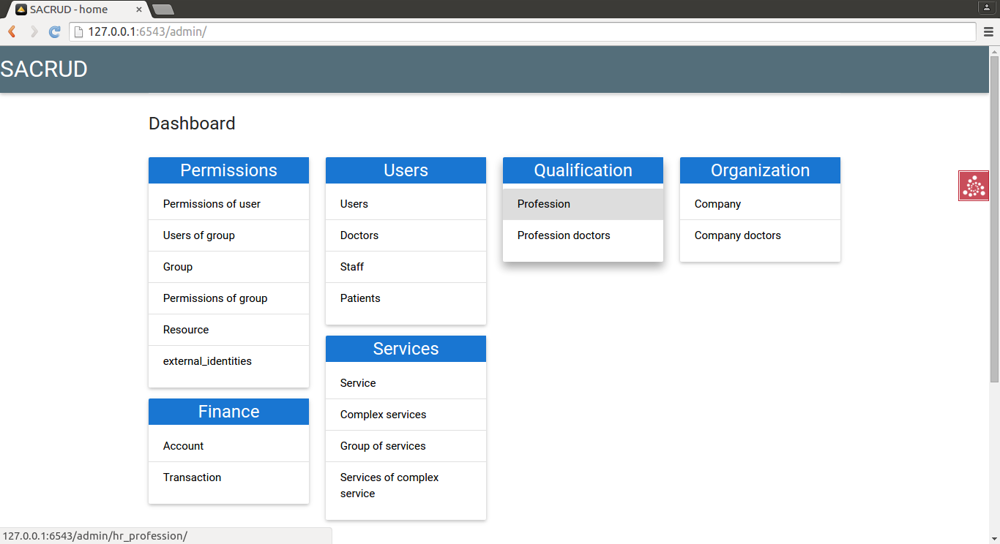

.. sacrud documentation master file, created by
   sphinx-quickstart on Fri Jun 27 15:28:02 2014.
   You can adapt this file completely to your liking, but it should at least
   contain the root `toctree` directive.

SACRUD
======

Overview
--------

sacrud - CRUD interface for SQLAlchemy with Pyramid gateway.

SACRUD will solve your problem of CRUD interface for SQLAlchemy,
by providing extension for Pyramid (yet) or use it in pure form.
Unlike classical CRUD interface, sacrud allows override and flexibly customize interface.
(that is closer to `django.contrib.admin`)

Look how easy it is to use with Pyramid:

.. code-block:: python

    config.include('pyramid_jinja2')
    config.add_jinja2_search_path("myprojectname:templates")

    from .models import (Model1, Model2, Model3,)
    # add sacrud and project models
    config.include('sacrud.pyramid_ext')
    settings = config.registry.settings
    settings['sacrud.models'] = {'Group1': {
                                    'tables': [Model1, Model2],
                                    'position': 1,},
                                 'Group2': {
                                    'tables': [Model3],
                                    'position': 4,}
                                }

go to http://localhost:6543/sacrud/

Usage
-----

.. toctree::
   :maxdepth: 3

   install
   configuration
   plain_usage
   api

.. include:: contribute.rst

Indices and tables
==================

* :ref:`genindex`
* :ref:`modindex`
* :ref:`search`

