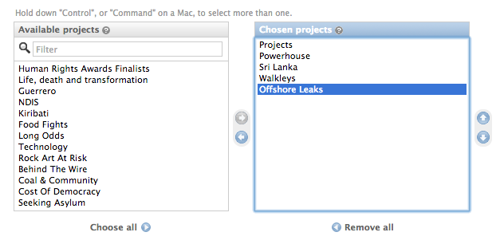
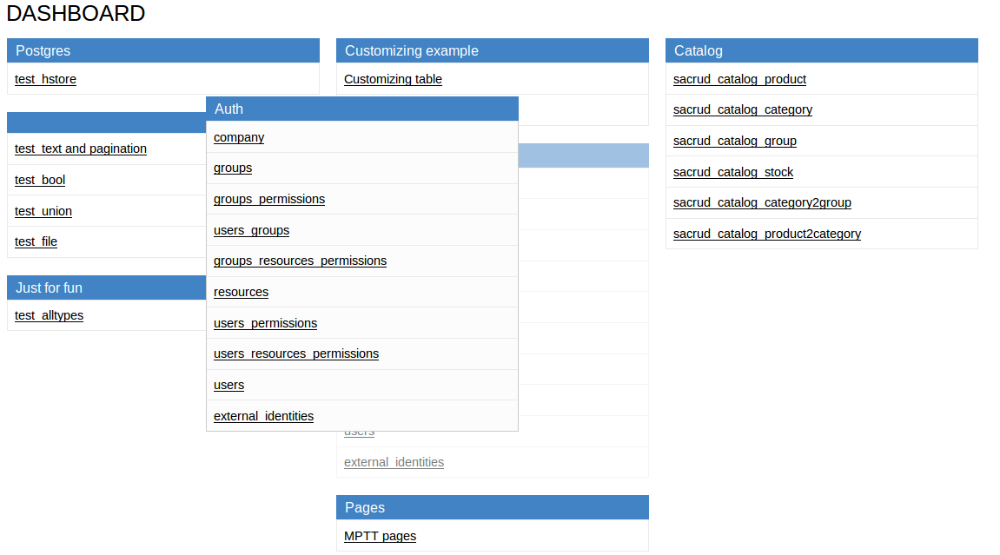

Application Configuration for Pyramid
=====================================

Initialize
----------

:mod:`pyramid_sacrud` use Jinja2 template renderer

.. code-block:: python
    :linenos:

    from .models import (Model1, Model2, Model3,)
    # add pyramid_sacrud and project models
    config.include('pyramid_sacrud')
    settings = config.registry.settings
    settings['pyramid_sacrud.models'] = {'Group1': {
                                             'tables': [Model1, Model2],
                                             'position': 1,},
                                         'Group2': {
                                             'tables': [Model3],
                                             'position': 4,}
                                        }

check it there http://localhost:6543/sacrud/

Set another prefix
~~~~~~~~~~~~~~~~~~

.. code-block:: python

    config.include('pyramid_sacrud', route_prefix='admin')

now it there http://localhost:6543/admin/

Configure models
----------------

Model verbose name
~~~~~~~~~~~~~~~~~~

.. code-block:: python
    :linenos:
    :emphasize-lines: 12

    class User(Base):

        __tablename__ = 'user'

        id = Column(Integer, primary_key=True)
        name = Column(String)

        def __init__(self, name):
            self.name = name

        # SACRUD
        verbose_name = 'My user model'

Instead "user", it will display "My user model"

.. image:: ../_static/img/verbose_name.png
    :alt: Model verbose name

Column verbose name
~~~~~~~~~~~~~~~~~~~

.. code-block:: python
    :linenos:
    :emphasize-lines: 7

    class User(Base):

        __tablename__ = 'user'

        id = Column(Integer, primary_key=True)
        name = Column(String,
                      info={"verbose_name": u'name of user', })

        def __init__(self, name):
            self.name = name

Instead "name", it will display "name of user"

.. image:: ../_static/img/column_verbose_name.png
    :alt: Column verbose name

Description for column
~~~~~~~~~~~~~~~~~~~~~~

.. code-block:: python
    :linenos:
    :emphasize-lines: 8

    class User(Base):

        __tablename__ = 'user'

        id = Column(Integer, primary_key=True)
        name = Column(String,
                      info={"verbose_name": u'name of user',
                            "description": "put there name"})

        def __init__(self, name):
            self.name = name

Adds a description below

.. image:: ../_static/img/column_description.png
    :alt: Column description

Add css class for column
~~~~~~~~~~~~~~~~~~~~~~~~

.. code-block:: python
    :linenos:
    :emphasize-lines: 14-16

    class TestCustomizing(Base):
        __tablename__ = "test_customizing"

        id = Column(Integer, primary_key=True)
        name = Column(String, info={"description": "put there name"})
        date = Column(Date, info={"verbose_name": 'date JQuery-ui'})
        name_ru = Column(String, info={"verbose_name": u'Название', })
        name_fr = Column(String, info={"verbose_name": u'nom', })
        name_bg = Column(String, info={"verbose_name": u'Име', })
        name_cze = Column(String, info={"verbose_name": u'název', })
        description = Column(Text)
        description2 = Column(Text)

        sacrud_css_class = {'tinymce': [description, description2],
                            'content': [description],
                            'name': [name], 'Date': [date]}

Adds css class for column

.. image:: ../_static/img/column_css.png
    :alt: Column with custom css classes

Configure displayed fields in grid
~~~~~~~~~~~~~~~~~~~~~~~~~~~~~~~~~~~~~

.. code-block:: python
    :linenos:
    :emphasize-lines: 18

    class TestCustomizing(Base):
        __tablename__ = "test_customizing"

        id = Column(Integer, primary_key=True)
        name = Column(String, info={"description": "put there name"})
        date = Column(Date, info={"verbose_name": 'date JQuery-ui'})
        name_ru = Column(String, info={"verbose_name": u'Название', })
        name_fr = Column(String, info={"verbose_name": u'nom', })
        name_bg = Column(String, info={"verbose_name": u'Име', })
        name_cze = Column(String, info={"verbose_name": u'název', })
        description = Column(Text)
        description2 = Column(Text)

        sacrud_css_class = {'tinymce': [description, description2],
                            'content': [description],
                            'name': [name], 'Date': [date]}

        sacrud_list_col = [name, name_ru, name_cze]

Use sacrud_list_col attribute of Model.
It shows only name, name_ru and name_cze columns in grid.

.. image:: ../_static/img/sacrud_list_col.png
    :alt: Hide columns in grid

Configure displayed columns for detailed object
~~~~~~~~~~~~~~~~~~~~~~~~~~~~~~~~~~~~~~~~~~~~~~~~~~

.. code-block:: python
    :linenos:
    :emphasize-lines: 19-28

    class TestCustomizing(Base):
        __tablename__ = "test_customizing"

        id = Column(Integer, primary_key=True)
        name = Column(String, info={"description": "put there name"})
        date = Column(Date, info={"verbose_name": 'date JQuery-ui'})
        name_ru = Column(String, info={"verbose_name": u'Название', })
        name_fr = Column(String, info={"verbose_name": u'nom', })
        name_bg = Column(String, info={"verbose_name": u'Име', })
        name_cze = Column(String, info={"verbose_name": u'název', })
        description = Column(Text)
        description2 = Column(Text)

        sacrud_css_class = {'tinymce': [description, description2],
                            'content': [description],
                            'name': [name], 'Date': [date]}

        sacrud_list_col = [name, name_ru, name_cze]

        sacrud_detail_col = [('name space', [name,
                                            ('i18 names', (name_ru, name_bg,
                                                            name_fr, name_cze)
                                            )]
                            ),
                            ('description', [description, date,
                                            (u"Расположение",
                                            (in_menu, visible, in_banner)
                                            ),
                                            description2])
                            ]

Use sacrud_detail_col attribute of Model.
It agregate and composite columns in detail view.

.. image:: ../_static/img/sacrud_detail_col.png
    :alt: Agregate columns

Models attributes as property
-----------------------------

Use :py:class:`sacrud.common.TableProperty` decorator.

.. literalinclude:: ../_pyramid_sacrud_example/sacrud_example/models/funny_models.py
   :linenos:
   :language: py
   :pyobject: MPTTPages
   :emphasize-lines: 6-21

Composite fields and column as custom function
----------------------------------------------

.. code-block:: python

    from pyramid_sacrud.common.custom import WidgetRelationship, WidgetRowLambda

Column as lambda function of row
~~~~~~~~~~~~~~~~~~~~~~~~~~~~~~~~

.. code-block:: python
    :linenos:
    :emphasize-lines: 15-17

    class TestCustomizing(Base):
        __tablename__ = "test_customizing"

        id = Column(Integer, primary_key=True)
        name = Column(String, info={"description": "put there name"})
        surname = Column(String, info={"description": "put there name"})
        middlename = Column(String, info={"description": "put there name"})
        date = Column(Date, info={"verbose_name": 'date JQuery-ui'})
        name_ru = Column(String, info={"verbose_name": u'Название', })
        name_fr = Column(String, info={"verbose_name": u'nom', })
        name_bg = Column(String, info={"verbose_name": u'Име', })
        name_cze = Column(String, info={"verbose_name": u'název', })

        sacrud_list_col = [
            WidgetRowLambda(name=_('Name'),
                            function=lambda x: x.surname + ' ' + x.name +
                            ' ' + x.middlename)
            name_ru, name_cze]

.. image:: ../_static/img/widget_row_lambda.png
    :alt: Column as lambda of row

Column as relationship
~~~~~~~~~~~~~~~~~~~~~~

.. code-block:: python
    :linenos:

    class User(Base):
        __tablename__ = 'users'
        verbose_name = _('Users')

        id = Column(Integer, primary_key=True, autoincrement=True)
        name = Column(Unicode, nullable=False)

    class Company2User(Base):
        __tablename__ = 'm2m_company2user'
        verbose_name = _('Company of user')

        user_id = Column(Integer, ForeignKey('user.id'), primary_key=True)
        user = relationship("User")
        company_id = Column(Integer, ForeignKey('company.id'), primary_key=True)
        company = relationship("Company")

    class Company(Base):
        __tablename__ = 'company'
        verbose_name = _('Company')

        id = Column(Integer, primary_key=True, autoincrement=True)
        name = Column(Unicode)
        company_id = Column(Integer, ForeignKey('company.id'), nullable=True,
                            info={'verbose_name': _('Main company')})
        company = relationship('Company')
        users = relationship('User', secondary='m2m_company2user',
                            backref='company')

        # SACRUD
        @TableProperty
        def sacrud_detail_col(cls):
            return [('', [Company.name, cls.c.company_id,
                        WidgetRelationship(Company.users,
                                            table=User,
                                            name=_("Users"),
                                            ),
                        WidgetRelationship(Company.company,
                                            table=Company,
                                            name=_("Affiliate company"),
                                            )
                        ]),
                    ]

        def __repr__(self):
            return self.name

**ManyToMany**

.. note::

    I think it should look like Django ManyToManyField.
    Will be made in the next version.
    |ManyToManyField|

.. code-block:: python
    :linenos:
    :emphasize-lines: 8-11

    users = relationship('User', secondary='m2m_company2user',
                        backref='company')

    # SACRUD
    @TableProperty
    def sacrud_detail_col(cls):
        return [('', [Company.name, cls.c.company_id,
                    WidgetRelationship(Company.users,
                                        table=User,
                                        name=_("Users"),
                                        ),
                    WidgetRelationship(Company.company,
                                        table=Company,
                                        name=_("Affiliate company"),
                                        )
                    ]),
                ]

**OneToMany**

.. code-block:: python
    :linenos:
    :emphasize-lines: 12-15

    users = relationship('User', secondary='m2m_company2user',
                        backref='company')

    # SACRUD
    @TableProperty
    def sacrud_detail_col(cls):
        return [('', [Company.name, cls.c.company_id,
                    WidgetRelationship(Company.users,
                                        table=User,
                                        name=_("Users"),
                                        ),
                    WidgetRelationship(Company.company,
                                        table=Company,
                                        name=_("Affiliate company"),
                                        )
                    ]),
                ]

Template redefinition
---------------------

Just create template file in your project template directory

.. code::

    myapp/
    └── templates
        └── sacrud

Dashboard config
----------------

Example from `<https://github.com/ITCase/pyramid_sacrud_example>`_

Configure your project:

.. literalinclude:: ../_pyramid_sacrud_example/sacrud_example/__init__.py
   :linenos:
   :emphasize-lines: 85-88
   :language: py

Dict of models example for :mod:`pyramid_sacrud`:

.. literalinclude:: ../_pyramid_sacrud_example/sacrud_example/sacrud_config.py
   :linenos:
   :emphasize-lines: 31-
   :language: py

Result:

