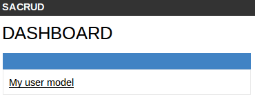
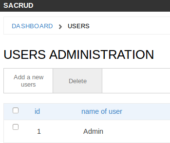
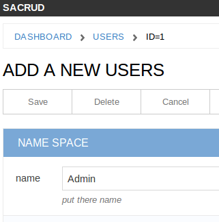
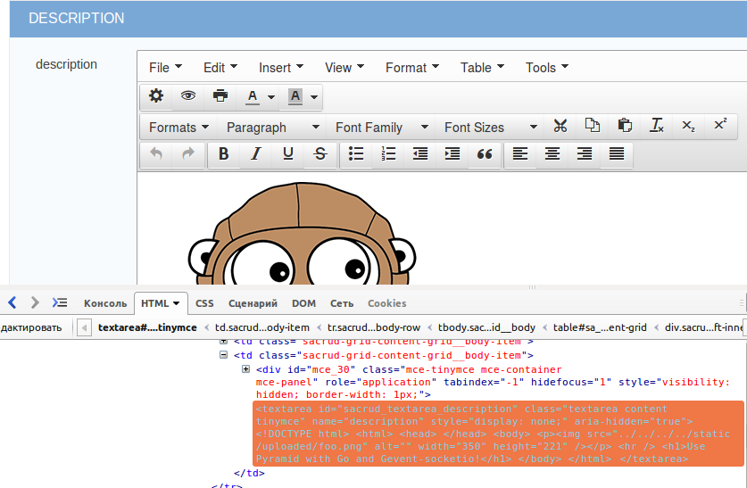
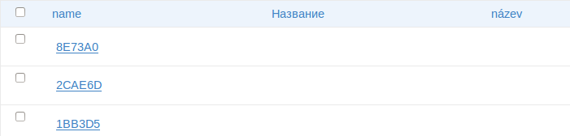
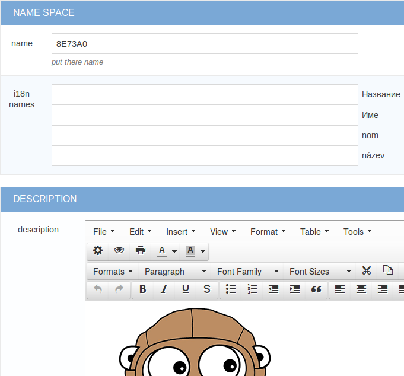

Application Configuration for Pyramid
=====================================

Initialize
----------

:mod:`pyramid_sacrud` use **Jinja2** template renderer

.. code-block:: python
    :linenos:

    from .models import (Model1, Model2, Model3,)
    # add pyramid_sacrud and project models
    config.include('pyramid_sacrud')
    settings = config.registry.settings
    settings['pyramid_sacrud.models'] = (
        ('Group1', [Model1, Model2]),
        ('Group2', [Model3])
    )

check it there http://localhost:6543/sacrud/

Set another prefix
~~~~~~~~~~~~~~~~~~

.. code-block:: python

    config.include('pyramid_sacrud', route_prefix='admin')

now it there http://localhost:6543/admin/

Configure models
----------------

Model verbose name
~~~~~~~~~~~~~~~~~~

.. code-block:: python
    :linenos:
    :emphasize-lines: 12

    class User(Base):

        __tablename__ = 'user'

        id = Column(Integer, primary_key=True)
        name = Column(String)

        def __init__(self, name):
            self.name = name

        # SACRUD
        verbose_name = 'My user model'

Instead "user", it will display "My user model"

Column verbose name
~~~~~~~~~~~~~~~~~~~

.. code-block:: python
    :linenos:
    :emphasize-lines: 7

    class User(Base):

        __tablename__ = 'user'

        id = Column(Integer, primary_key=True)
        name = Column(String,
                      info={"colanderalchemy": {'title': u'name of user'}})

        def __init__(self, name):
            self.name = name

Instead "name", it will display "name of user"

Description for column
~~~~~~~~~~~~~~~~~~~~~~

.. code-block:: python
    :linenos:
    :emphasize-lines: 8

    class User(Base):

        __tablename__ = 'user'

        id = Column(Integer, primary_key=True)
        name = Column(String,
                      info={"colanderalchemy": {'title': u'name of user',
                                                'description': 'put username there'}})

        def __init__(self, name):
            self.name = name

Adds a description below

Add css class for column
~~~~~~~~~~~~~~~~~~~~~~~~

.. code-block:: python
    :linenos:
    :emphasize-lines: 1,8

    tinymce_widget = deform.widget.TextAreaWidget(css_class='tinymce content')

    class TestCustomizing(Base):
        __tablename__ = "test_customizing"

        id = Column(Integer, primary_key=True)
        description = Column(Text, info={'colanderalchemy': {'widget': tinymce_widget}})

Adds css class for column

Configure displayed fields in grid
~~~~~~~~~~~~~~~~~~~~~~~~~~~~~~~~~~~~~

.. code-block:: python
    :linenos:
    :emphasize-lines: 14

    class TestCustomizing(Base):
        __tablename__ = "test_customizing"

        id = Column(Integer, primary_key=True)
        name = Column(String)
        date = Column(Date)
        name_ru = Column(String)
        name_fr = Column(String)
        name_bg = Column(String)
        name_cze = Column(String)
        description = Column(Text)
        description2 = Column(Text)

        sacrud_list_col = [name, name_ru, name_cze]

Use ``sacrud_list_col`` attribute of Model.
It shows only name, name_ru and name_cze columns in grid.

Configure displayed columns for detailed object
~~~~~~~~~~~~~~~~~~~~~~~~~~~~~~~~~~~~~~~~~~~~~~~~~~

.. code-block:: python
    :linenos:
    :emphasize-lines: 19-28

    class TestCustomizing(Base):
        __tablename__ = "test_customizing"

        id = Column(Integer, primary_key=True)
        name = Column(String)
        date = Column(Date)
        name_ru = Column(String)
        name_fr = Column(String)
        name_bg = Column(String)
        name_cze = Column(String)
        description = Column(Text)
        description2 = Column(Text)

        sacrud_detail_col = [
            ('name space', [name, name_ru, name_bg, name_fr, name_cze]),
            ('description', [description, date, in_menu, visible, in_banner, description2])
        ]

Use ``sacrud_detail_col`` attribute of Model.
It agregate and composite columns in detail view.

Models attributes as property
-----------------------------

Use :class:`sacrud.common.TableProperty` decorator.

Composite fields and column as custom function
----------------------------------------------

.. code-block:: python

   class WidgetRowLambda(object):
       name = "Name"
       info = {
           "sacrud_list_content": lambda x: ' '.join([x.surname, x.name, x.middlename])
       }

Not escape string:

.. code-block:: python
   :emphasize-lines: 3

   class WidgetSafeHtml(object):
       name = "Name"
       safe = True
       info = {
           "sacrud_list_content": lambda x: x.html
       }

Example with relationship:

.. code-block:: python

   class WidgetRelationship(object):

       def __init__(self, relationship):
           self.name = relationship.key
           self.info = {
               "sacrud_list_content": lambda x: getattr(x, self.name)
           }

Column as lambda function of row
~~~~~~~~~~~~~~~~~~~~~~~~~~~~~~~~

.. code-block:: python
    :linenos:
    :emphasize-lines: 15-17

    class TestCustomizing(Base):
        __tablename__ = "test_customizing"

        id = Column(Integer, primary_key=True)
        name = Column(String, info={"description": "put there name"})
        surname = Column(String, info={"description": "put there name"})
        middlename = Column(String, info={"description": "put there name"})
        date = Column(Date, info={"verbose_name": 'date JQuery-ui'})
        name_ru = Column(String, info={"verbose_name": u'Название', })
        name_fr = Column(String, info={"verbose_name": u'nom', })
        name_bg = Column(String, info={"verbose_name": u'Име', })
        name_cze = Column(String, info={"verbose_name": u'název', })

        sacrud_list_col = [
            WidgetRowLambda(),
            name_ru, name_cze]

.. image:: ../_static/img/widget_row_lambda.png
    :alt: Column as lambda of row

Column as relationship
~~~~~~~~~~~~~~~~~~~~~~

.. code-block:: python
    :linenos:
    :emphasize-lines: 39

    class User(Base):
        __tablename__ = 'users'
        verbose_name = _('Users')

        id = Column(Integer, primary_key=True, autoincrement=True)
        name = Column(Unicode, nullable=False)

    class Company2User(Base):
        __tablename__ = 'm2m_company2user'
        verbose_name = _('Company of user')

        user_id = Column(Integer, ForeignKey('user.id'), primary_key=True)
        user = relationship("User",
            info={'colanderalchemy': {'title': _("Users")}}
        )
        company_id = Column(Integer, ForeignKey('company.id'), primary_key=True)
        company = relationship("Company",
            info={'colanderalchemy': {'title': _("Affiliate company")}}
        )

    class Company(Base):
        __tablename__ = 'company'
        verbose_name = _('Company')

        id = Column(Integer, primary_key=True, autoincrement=True)
        name = Column(Unicode)
        company_id = Column(Integer, ForeignKey('company.id'), nullable=True,
                            info={'verbose_name': _('Main company')})
        company = relationship('Company')
        users = relationship('User', secondary='m2m_company2user',
                            backref='company')

        # SACRUD
        @TableProperty
        def sacrud_detail_col(cls):
            return [('', [Company.name, cls.c.company_id,
                          Company.users, Company.company])
                   ]

        def __repr__(self):
            return self.name

**ManyToMany**

.. code-block:: python
    :linenos:
    :emphasize-lines: 8-11

    users = relationship('User', secondary='m2m_company2user',
                        backref='company')

    # SACRUD
    @TableProperty
    def sacrud_detail_col(cls):
        return [('', [Company.name, cls.c.company_id, Company.users])]

Template redefinition
---------------------

Just create template file in your project templates/sacrud directory

.. code::

    myapp/
    └── templates
        └── sacrud
              └── home.jinja2  <-- custom template for pyramid_sacrud home page

You can also change the template for just one model or your own for each model.

.. code-block:: python
    :linenos:
    :emphasize-lines: 8-9

    class Tree(Base):
        __tablename__ = 'tree'

        id = Column(Integer, primary_key=True)
        name = Column(Unicode)
        parent_id = Column(Integer, ForeignKey('tree.id'))

        sacrud_list_template = 'myapp:/templates/my_custom_list_with_jqtree.jinja2'
        sacrud_edit_template = 'myapp:/templates/my_custom_edit.mako'
